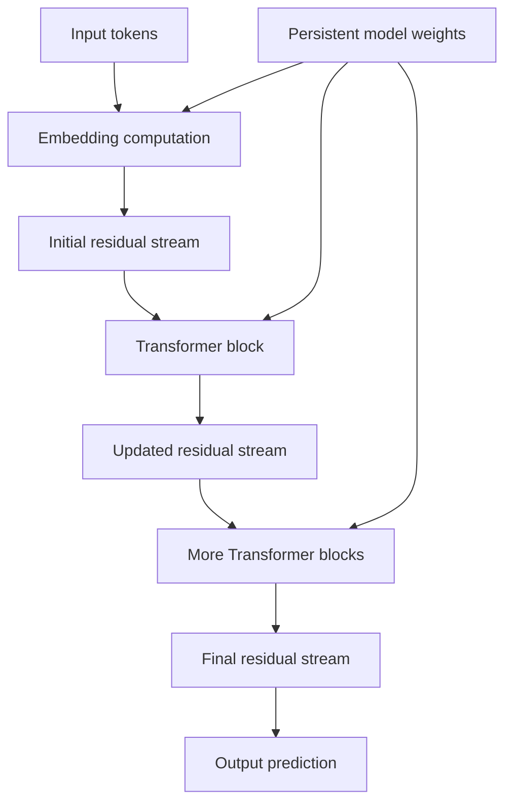
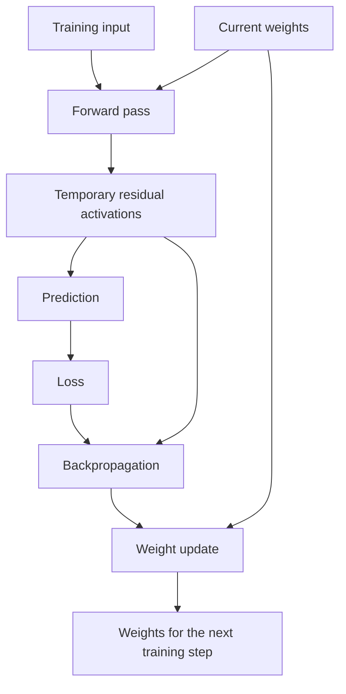
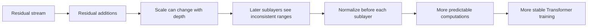
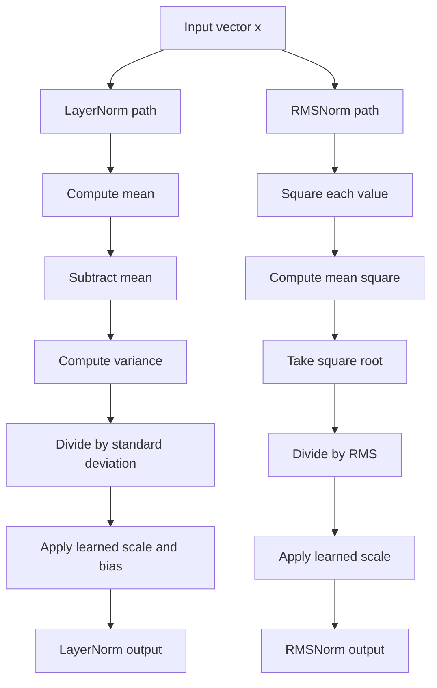
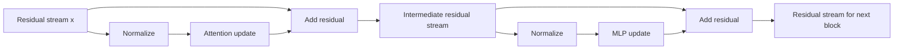

# Layer Normalization and RMS Normalization

This tutorial explains two small but important components of modern neural networks: **Layer Normalization (LayerNorm)** and **Root Mean Square Normalization (RMSNorm)**. You do not need an AI or machine-learning background. Familiarity with vectors, averages, and basic software architecture is enough.

## 1. The problem normalization solves

A neural network is a pipeline of numerical transformations. Each layer receives a vector of numbers, performs a calculation, and passes another vector to the next layer. These intermediate numbers are called **activations**.

For example, one layer might receive:

$$
\mathbf{x} = [1.2, -0.3, 4.7, 0.8]
$$

In a deep network, activations pass through dozens or hundreds of layers. Their scale can drift as they go:

- some vectors may contain very large values;
- others may contain values close to zero;
- one layer may receive a very different numerical range from the range it saw earlier in training.

This is similar to a long software pipeline in which every stage silently changes units. A downstream component becomes harder to operate reliably if one caller sends meters, another sends millimeters, and the units continue changing over time.

Normalization gives each layer a more predictable numerical input. It does not make every vector identical. It preserves useful relative information while controlling properties such as its average and overall magnitude.

This usually makes the network easier and more stable to train.

## 2. Where the vectors come from

Text models usually convert each token into a vector. If the model's hidden size is $d$, one token is represented by:

$$
\mathbf{x} = [x_1, x_2, \ldots, x_d]
$$

A real model might use thousands of numbers per token. You can think of these numbers as an internal state. Individual coordinates usually do not have simple, human-assigned meanings; useful information is distributed across the vector.

For a batch of token sequences, an implementation commonly stores activations in a tensor with shape:

$$
[\text{batch size},\ \text{sequence length},\ \text{hidden size}]
$$

LayerNorm and RMSNorm normally operate independently on each token's $d$-dimensional vector. One token's normalization does not depend on other tokens or other requests in the batch.

That locality is operationally useful: the result for one input does not change merely because it was batched with different inputs.

## 3. Weights versus the residual stream

Before discussing normalization, separate two kinds of model state.

### Persistent state: weights

A trained model has parameters such as embedding matrices, attention matrices, and MLP matrices:

$$
\boldsymbol{\theta}
= \{W_{\text{embedding}}, W_{\text{attention}}, W_{\text{MLP}}, \ldots\}
$$

These weights persist across requests. Training changes them; ordinary inference does not. The model's learned behavior, skills, and associations are distributed across these parameters.

It is common to describe an MLP as a learned association or lookup mechanism. That is a useful intuition, but it is not a literal lookup table, and knowledge is not stored only in MLP weights. Embeddings, attention parameters, MLP parameters, and their interactions all contribute to the model's learned behavior.

### Temporary state: the residual stream

The **residual stream** is the working state created for a particular forward pass. It begins with token embeddings and is repeatedly updated by Transformer blocks.

For layer $l$, a simplified update is:

$$
\mathbf{x}^{(l+1)}
= \mathbf{x}^{(l)} + \Delta\mathbf{x}^{(l)}
$$

The tensor shape normally remains the same from block to block, but its values—and therefore what it represents—change. For one prompt, an activation may represent a combination such as “France + capital”; for another prompt, it may represent something entirely different.



A helpful—but deliberately approximate—analogy is:

| Transformer concept | Software/human analogy |
|---|---|
| Weights | Persistent program state, long-term memory, and learned skills |
| Residual stream | Request-local working memory |
| Attention and MLP sublayers | Computations that read and update the working state |

Attention often moves or combines information among tokens in the current context. An MLP often transforms a token's current representation using patterns learned in its weights. This distinction is useful, but not absolute: attention also uses learned weights, and both sublayers participate in complex distributed computations.

### The residual stream exists during both training and inference

The precise definition is:

> The residual stream is temporary activation state produced during a forward pass.

It therefore exists during pre-training, supervised fine-tuning, preference optimization, and inference.

During inference, the model creates activations and produces an output while its weights remain fixed. During training, the forward pass creates the same kind of activations, but some are retained long enough for backpropagation to calculate weight updates.



The weights persist into the next training step. The residual activations are generated anew for the next batch and can be released after they are no longer needed.

### From residual connections to normalization

This distinction leads directly to the motivation for LayerNorm and RMSNorm.

Each attention or MLP sublayer calculates an update and adds it to the residual stream:

$$
\mathbf{x}^{(l+1)}
= \mathbf{x}^{(l)} + \Delta\mathbf{x}^{(l)}
$$

After $L$ blocks, repeated substitution gives:

$$
\mathbf{x}^{(L)}
= \mathbf{x}^{(0)}
+ \sum_{l=0}^{L-1}\Delta\mathbf{x}^{(l)}
$$

The representation becomes richer because it incorporates the results of many computations. Its shape remains $[B,S,D]$, but its numerical scale need not remain constant. Depending on how the updates are distributed and aligned, repeated additions can increase, decrease, or otherwise change the residual stream's magnitude. Growth is common enough that every later sublayer cannot simply assume it will always receive values in the same range.

Attention and MLP calculations contain matrix multiplications and nonlinear functions whose behavior depends on input scale. If the input scale varies greatly with depth or during training, optimization becomes harder and lower-precision arithmetic becomes less forgiving.

Normalization acts as an adapter at the sublayer boundary. It converts the current residual vector $\mathbf{x}^{(l)}$ into a controlled input $\mathbf{z}^{(l)}$:

$$
\mathbf{z}^{(l)} = \operatorname{Norm}(\mathbf{x}^{(l)})
$$

The sublayer then computes its update from that normalized input:

$$
\Delta\mathbf{x}^{(l)} = F_l(\mathbf{z}^{(l)})
$$

In a pre-norm block, the update is finally added to the original, unnormalized residual stream:

$$
\mathbf{x}^{(l+1)}
= \mathbf{x}^{(l)}
+ F_l\!\left(\operatorname{Norm}(\mathbf{x}^{(l)})\right)
$$

Normalization therefore does not necessarily clamp the residual stream itself. Instead, it gives each attention or MLP sublayer a predictable view of that stream before computing the next update. Pre-norm models normally add one final normalization after the last block; section 11 returns to it.



This is the motivating chain to keep in mind:

$$
\boxed{
\text{residual stream}
\rightarrow \text{residual additions}
\rightarrow \text{scale drift}
\rightarrow \text{normalization}
\rightarrow \text{pre-norm}
\rightarrow \text{training stability}
}
$$

## 4. Layer Normalization

LayerNorm performs two conceptual operations:

1. center the vector by subtracting its mean;
2. scale the centered vector so that its variance is approximately one.

It then applies learned per-coordinate scale and bias parameters so the network can choose the most useful final representation.

### Step 1: Compute the mean

For a vector with $d$ elements, its mean is:

$$
\mu = \frac{1}{d}\sum_{i=1}^{d} x_i
$$

### Step 2: Compute the variance

The variance measures how far the elements are spread from the mean:

$$
\sigma^2 = \frac{1}{d}\sum_{i=1}^{d}(x_i - \mu)^2
$$

LayerNorm uses the population-variance form above: the denominator is $d$, not $d-1$.

### Step 3: Center and scale

Each element is normalized with:

$$
\hat{x}_i = \frac{x_i - \mu}{\sqrt{\sigma^2 + \epsilon}}
$$

The small positive constant $\epsilon$ prevents division by zero and improves numerical stability.

Ignoring $\epsilon$ for a moment, the resulting vector has mean zero and variance one:

$$
\frac{1}{d}\sum_{i=1}^{d}\hat{x}_i = 0
$$

$$
\frac{1}{d}\sum_{i=1}^{d}\hat{x}_i^2 = 1
$$

### Step 4: Apply learned scale and bias

For each coordinate, LayerNorm learns a scale $\gamma_i$ and a bias $\beta_i$:

$$
y_i = \gamma_i\hat{x}_i + \beta_i
$$

The complete LayerNorm operation is therefore:

$$
y_i = \gamma_i
\frac{x_i - \mu}{\sqrt{\sigma^2 + \epsilon}}
+ \beta_i
$$

Why normalize and then immediately allow the network to change the scale and bias? The normalization provides a stable reference point, while $\boldsymbol{\gamma}$ and $\boldsymbol{\beta}$ preserve flexibility. If the network benefits from a particular coordinate being larger, smaller, or shifted, it can learn that behavior.

## 5. A concrete LayerNorm example

Consider:

$$
\mathbf{x} = [1, 2, 3]
$$

The mean is:

$$
\mu = \frac{1+2+3}{3} = 2
$$

The variance is:

$$
\sigma^2
= \frac{(1-2)^2 + (2-2)^2 + (3-2)^2}{3}
= \frac{2}{3}
$$

Ignoring $\epsilon$, the standard deviation is:

$$
\sigma = \sqrt{\frac{2}{3}} \approx 0.8165
$$

The normalized vector is:

$$
\hat{\mathbf{x}}
= \frac{[1,2,3]-2}{0.8165}
\approx [-1.2247, 0, 1.2247]
$$

If the initial learned parameters are $\boldsymbol{\gamma}=[1,1,1]$ and $\boldsymbol{\beta}=[0,0,0]$, the output is initially the same as $\hat{\mathbf{x}}$.

Notice what LayerNorm preserved: the first value is below the vector's average, the second is at the average, and the third is above it. It changed the coordinate system, not the ordering relationship.

## 6. RMS Normalization

RMSNorm is a simpler relative of LayerNorm. It controls the vector's magnitude but does not center the vector around zero.

First compute the vector's root mean square, or RMS:

$$
\operatorname{RMS}(\mathbf{x})
= \sqrt{\frac{1}{d}\sum_{i=1}^{d}x_i^2}
$$

Then divide each element by that value and apply a learned scale:

$$
y_i = \gamma_i
\frac{x_i}{\sqrt{\operatorname{RMS}(\mathbf{x})^2 + \epsilon}}
$$

As in LayerNorm, the small positive constant $\epsilon$ sits inside the square root, where it keeps the denominator away from zero. Leaving it out of $\operatorname{RMS}$ itself mirrors how LayerNorm keeps $\epsilon$ out of $\sigma^2$, and it lets the identities in section 8 be stated exactly.

Unlike the usual LayerNorm definition, RMSNorm normally has no learned bias $\beta_i$. Some implementations may offer one, so the exact library API is worth checking.

The name comes directly from the denominator: **root mean square normalization**.

## 7. A concrete RMSNorm example

Use the same vector:

$$
\mathbf{x} = [1,2,3]
$$

Its root mean square is:

$$
\operatorname{RMS}(\mathbf{x})
= \sqrt{\frac{1^2+2^2+3^2}{3}}
= \sqrt{\frac{14}{3}}
\approx 2.1602
$$

Ignoring $\epsilon$ and using $\boldsymbol{\gamma}=[1,1,1]$, RMSNorm produces:

$$
\mathbf{y}
= \frac{[1,2,3]}{2.1602}
\approx [0.4629, 0.9258, 1.3887]
$$

The result is not centered around zero. Its RMS, however, is one:

$$
\sqrt{\frac{1}{d}\sum_{i=1}^{d}y_i^2} = 1
$$

## 8. The key difference

LayerNorm removes both the vector's mean and its overall scale. RMSNorm removes only its overall scale.

| Property | LayerNorm | RMSNorm |
|---|---:|---:|
| Subtracts the mean | Yes | No |
| Controls overall magnitude | Yes | Yes |
| Learned per-coordinate scale $\boldsymbol{\gamma}$ | Yes | Yes |
| Learned per-coordinate bias $\boldsymbol{\beta}$ | Usually yes | Usually no |
| Main statistics required | Mean and variance | Mean square |
| Typical computational cost | Slightly higher | Slightly lower |

The operations can be visualized side by side:



Another useful way to see the difference is through the Euclidean norm:

$$
\lVert\mathbf{x}\rVert_2 = \sqrt{\sum_{i=1}^{d}x_i^2}
$$

Since

$$
\operatorname{RMS}(\mathbf{x})
= \frac{\lVert\mathbf{x}\rVert_2}{\sqrt{d}}
$$

RMSNorm without its learned scale can be written as:

$$
\frac{\mathbf{x}}{\operatorname{RMS}(\mathbf{x})}
= \sqrt{d}\frac{\mathbf{x}}{\lVert\mathbf{x}\rVert_2}
$$

Geometrically, RMSNorm keeps the vector's direction and places it on a sphere with radius $\sqrt{d}$. LayerNorm first removes the component corresponding to a uniform shift of all coordinates, then controls the remaining vector's magnitude.

The two statistics are connected by a useful identity:

$$
\operatorname{RMS}(\mathbf{x})^2 = \sigma^2 + \mu^2
$$

RMSNorm uses the total squared magnitude on the left. LayerNorm removes the mean first and uses the remaining spread, $\sigma^2$. When the mean is already close to zero, the two denominators are close; when the mean is large, they can differ substantially.

## 9. Scale and shift behavior

Suppose every element is multiplied by the same positive constant $a$.

Ignoring $\epsilon$ and learned parameters, both normalizers are unchanged:

$$
\operatorname{LayerNorm}(a\mathbf{x})
= \operatorname{LayerNorm}(\mathbf{x})
$$

$$
\operatorname{RMSNorm}(a\mathbf{x})
= \operatorname{RMSNorm}(\mathbf{x})
$$

Now suppose the same constant $b$ is added to every element. Let $\mathbf{1}$ be the all-ones vector. LayerNorm removes this uniform shift:

$$
\operatorname{LayerNorm}(\mathbf{x}+b\mathbf{1})
= \operatorname{LayerNorm}(\mathbf{x})
$$

RMSNorm does not:

$$
\operatorname{RMSNorm}(\mathbf{x}+b\mathbf{1})
\ne \operatorname{RMSNorm}(\mathbf{x})
$$

This is the essential tradeoff. RMSNorm assumes that explicitly removing the mean is unnecessary for the model architecture in question. In many modern language models, that simpler operation works well.

## 10. Why normalization helps training

Training means repeatedly adjusting millions or billions of parameters to reduce an error measure called a **loss**. The adjustment signal is a gradient: roughly, how much changing each parameter would change the loss.

Deep networks are numerically coupled systems. A scale change in an early layer affects every later layer. Without scale control, the model can enter poorly behaved regimes:

- very large activations can produce very large or unstable updates;
- very small activations or gradients can make learning extremely slow;
- each layer must continually adapt to scale changes produced by earlier layers;
- limited-precision arithmetic is less forgiving when values span extreme ranges.

Normalization introduces a predictable scale at known points in the network. This generally allows optimization to proceed more reliably and often permits larger learning rates.

Normalization does **not** guarantee that every later value is bounded, nor does it replace other stability techniques. Learned scales, matrix multiplications, residual additions, nonlinear functions, initialization, and optimizer settings still matter.

## 11. How this fits into a Transformer

A Transformer is the architecture behind many modern language models. It is built from repeated blocks. Each block contains major subcomponents such as attention and a feed-forward network, plus a **residual connection**.

A residual connection adds a component's output back to its input:

$$
\mathbf{x}_{\text{next}} = \mathbf{x} + F(\mathbf{x})
$$

The function $F$ may be attention or a feed-forward network.

In many modern **pre-norm** Transformers, normalization is applied before the subcomponent:

$$
\mathbf{x}_{\text{next}}
= \mathbf{x} + F(\operatorname{Norm}(\mathbf{x}))
$$

Here, $\operatorname{Norm}$ may be LayerNorm or RMSNorm. The residual path still carries $\mathbf{x}$ directly, while the subcomponent receives a controlled input scale.

A complete block usually has two residual updates. In simplified form:

$$
\mathbf{u}^{(l)}
= \mathbf{x}^{(l)}
+ \operatorname{Attention}_l\!\left(
\operatorname{Norm}_l^{(1)}(\mathbf{x}^{(l)})
\right)
$$

$$
\mathbf{x}^{(l+1)}
= \mathbf{u}^{(l)}
+ \operatorname{MLP}_l\!\left(
\operatorname{Norm}_l^{(2)}(\mathbf{u}^{(l)})
\right)
$$

Attention primarily lets a token gather and combine information from other tokens in the current context. The MLP performs a learned nonlinear transformation on each token independently. Both produce updates that are written into the same residual stream.

The following diagram shows a typical pre-norm Transformer block. Each sublayer computes an update, $\Delta\mathbf{x}$, which is added to the shared residual stream.



### The final normalization

Because a pre-norm block adds its update to the unnormalized residual stream, nothing inside the stack controls the magnitude of the stream itself. Pre-norm models therefore apply one more normalization after the last block, before the output projection that maps the residual stream to vocabulary scores:

$$
\text{logits}
= W_{\text{unembedding}}
\operatorname{Norm}\!\left(\mathbf{x}^{(L)}\right)
$$

This final norm is easy to omit when implementing a model as a loop over identical blocks, because it belongs to the model rather than to any single block. A post-norm stack needs it less, since its last operation is already a normalization.

An older **post-norm** arrangement applies normalization after the residual addition:

$$
\mathbf{x}_{\text{next}}
= \operatorname{Norm}(\mathbf{x}+F(\mathbf{x}))
$$

Placement affects training dynamics; it is not merely a code-style choice. When reading a model implementation, check both which normalization it uses and where it is placed.

### Why pre-norm often improves stability

Pre-norm provides two related benefits.

First, every attention and MLP sublayer receives a normalized input even if the residual stream's magnitude changes across layers. The sublayer is therefore not forced to continually adapt to a moving numerical scale.

Second, the residual path itself remains a direct identity path. In the simplified update

$$
\mathbf{x}^{(l+1)}
= \mathbf{x}^{(l)}
+ F_l\!\left(\operatorname{Norm}(\mathbf{x}^{(l)})\right)
$$

the earlier state $\mathbf{x}^{(l)}$ is copied directly into the addition. During backpropagation, this supplies a simple route through many blocks, helping gradient signals reach earlier layers.

Post-norm can also work and has been used successfully, but training very deep post-norm Transformers often requires more care. Pre-norm is popular because it tends to make optimization more forgiving. It does not guarantee stability by itself: initialization, residual scaling, learning rate, optimizer behavior, precision, and architecture still matter.

## 12. Pseudocode

The following pseudocode assumes that `x` contains one or more vectors and that the last dimension is the hidden dimension.

```python
def layer_norm(x, gamma, beta, eps):
    mean = x.mean(axis=-1, keepdims=True)
    variance = ((x - mean) ** 2).mean(axis=-1, keepdims=True)
    normalized = (x - mean) / sqrt(variance + eps)
    return gamma * normalized + beta


def rms_norm(x, gamma, eps):
    mean_square = (x ** 2).mean(axis=-1, keepdims=True)
    normalized = x / sqrt(mean_square + eps)
    return gamma * normalized
```

`keepdims=True` matters because the per-vector statistic must be broadcast back across the hidden dimension.

Production implementations are more complex. They often fuse several operations into one GPU kernel, accumulate statistics in higher precision, and use architecture-specific strategies to reduce memory traffic.

## 13. Why RMSNorm can be faster

LayerNorm needs enough information to calculate both a mean and a variance, then it must subtract the mean. RMSNorm needs only the mean of the squared values and does not perform centering.

That means RMSNorm has:

- fewer arithmetic operations;
- fewer statistics to compute;
- no bias parameter in its usual form;
- opportunities for a simpler optimized kernel.

An optimized LayerNorm kernel may compute its statistics together in one pass, so the exact number of hardware reduction passes is implementation-dependent.

The real end-to-end speedup depends on hardware, tensor sizes, kernel fusion, memory bandwidth, and the rest of the model. The normalization layer is only one part of a Transformer block, so “RMSNorm uses fewer operations” does not imply that the entire model becomes proportionally faster.

## 14. LayerNorm is not BatchNorm

The names are easy to confuse.

**Batch Normalization (BatchNorm)** computes statistics using multiple examples in a batch. Its behavior can therefore depend on which examples happen to be processed together, and it typically keeps running statistics for inference.

**LayerNorm** and **RMSNorm** compute statistics within each individual token vector. They use the same kind of calculation during training and inference and do not require running averages gathered from previous batches.

For variable-length sequence models and request-by-request language-model inference, this independence is a major reason LayerNorm-style techniques are a natural fit.

## 15. Common implementation pitfalls

### Normalizing over the wrong axes

In a tensor shaped as

$$
[B,S,D]
$$

where $B$ is batch size, $S$ is sequence length, and $D$ is hidden size, Transformer normalization normally reduces over $D$ only. Accidentally reducing over $B$ or $S$ changes the operation and couples unrelated examples or tokens.

### Putting $\epsilon$ in the wrong place

The usual denominator is:

$$
\sqrt{v + \epsilon}
$$

where $v$ is the variance or mean square. This is different from:

$$
\sqrt{v} + \epsilon
$$

Use the definition expected by the model whose weights you are loading.

### Assuming all libraries use the same defaults

Libraries and model families can differ in:

- the value of $\epsilon$;
- whether RMSNorm has a bias;
- parameter names and shapes;
- when lower-precision inputs are converted to higher precision;
- the exact placement of normalization in a block.

These details matter when reproducing a model or transferring weights.

### Expecting exact identities in floating-point arithmetic

Statements such as scale invariance are mathematical descriptions that ignore $\epsilon$, rounding, overflow, and underflow. Real implementations are only approximately invariant.

## 16. How to choose between them

If you are implementing an existing architecture, use the normalization specified by that architecture. LayerNorm and RMSNorm are not interchangeable when loading trained weights.

If you are designing and training a new model:

- **LayerNorm** is the conservative, broadly established choice and explicitly removes uniform coordinate shifts.
- **RMSNorm** is attractive when its simpler computation works well for the architecture and training setup.

The choice is empirical. A small theoretical reduction in work is not valuable if it harms model quality or stability, and a theoretically stronger normalization is not automatically preferable if the extra centering is unnecessary.

## 17. A compact mental model

Keep these five ideas:

1. Weights are the model's persistent learned state.
2. The residual stream is temporary working state created during each forward pass.
3. Transformer blocks repeatedly add updates to that fixed-shape working state.
4. Normalization gives each sublayer a more predictable numerical input.
5. LayerNorm controls both center and scale; RMSNorm controls scale only.

In formula form:

$$
\boxed{
\operatorname{LayerNorm}(\mathbf{x})
= \boldsymbol{\gamma}\odot
\frac{\mathbf{x}-\mu}{\sqrt{\sigma^2+\epsilon}}
+ \boldsymbol{\beta}
}
$$

$$
\boxed{
\operatorname{RMSNorm}(\mathbf{x})
= \boldsymbol{\gamma}\odot
\frac{\mathbf{x}}
{\sqrt{\frac{1}{d}\sum_{i=1}^{d}x_i^2+\epsilon}}
}
$$

Here, $\odot$ means element-by-element multiplication. The practical difference is the subtraction of $\mu$ and, conventionally, the presence or absence of $\boldsymbol{\beta}$.

That small difference is the heart of LayerNorm versus RMSNorm.
