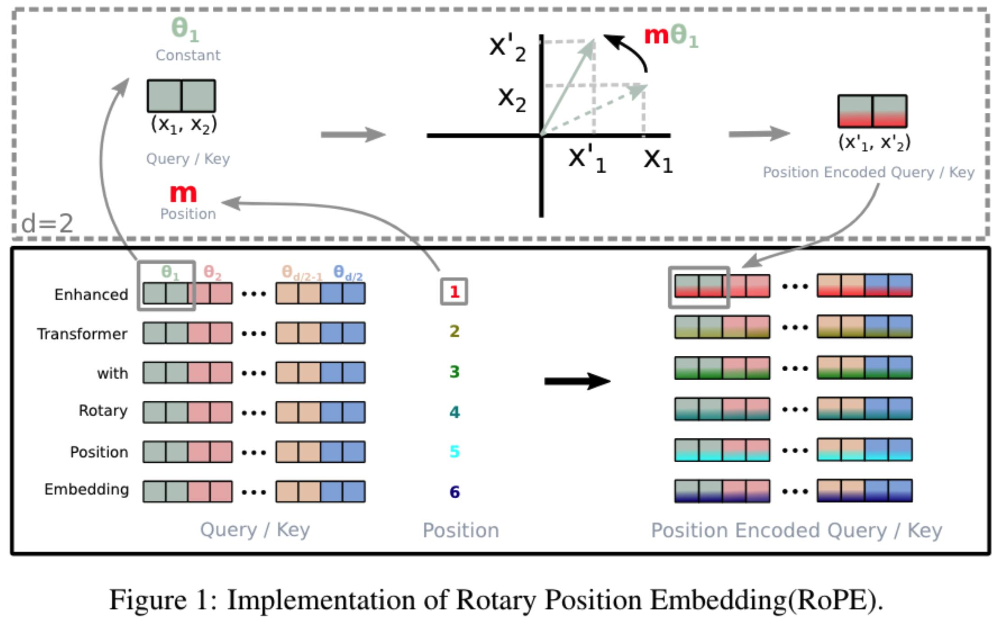
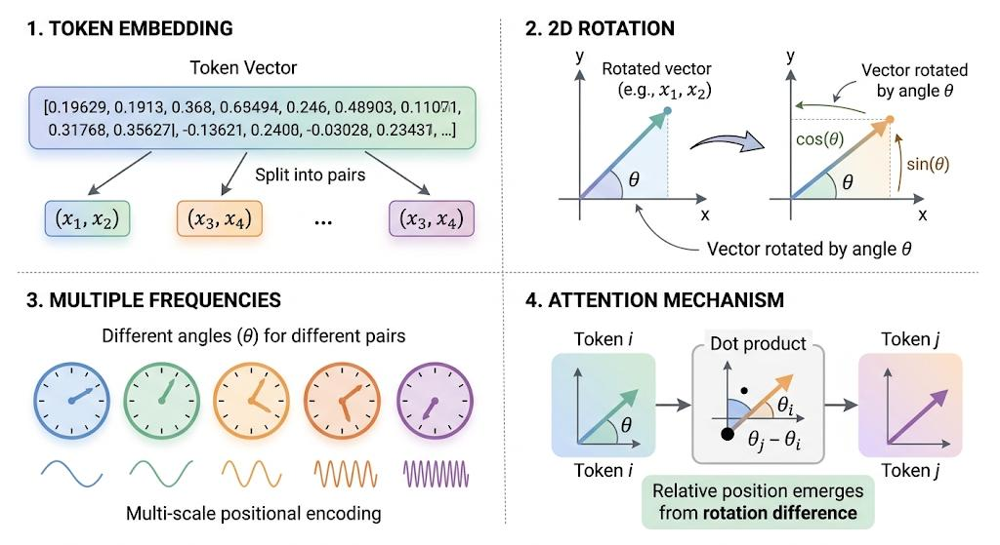
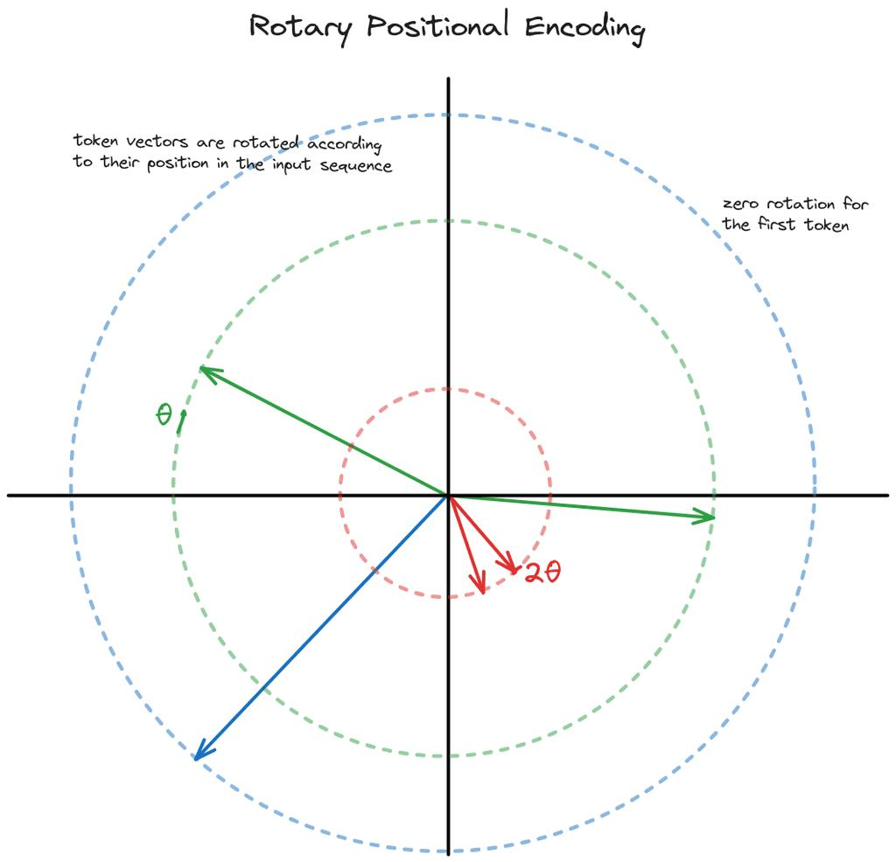
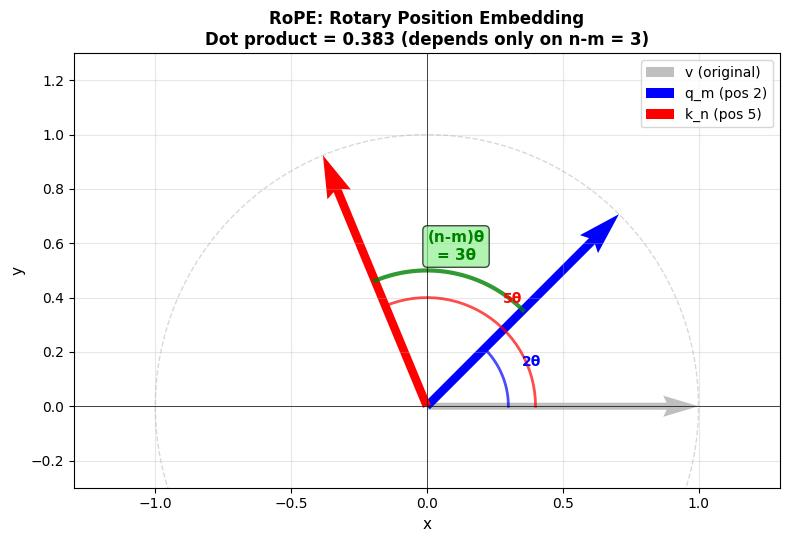
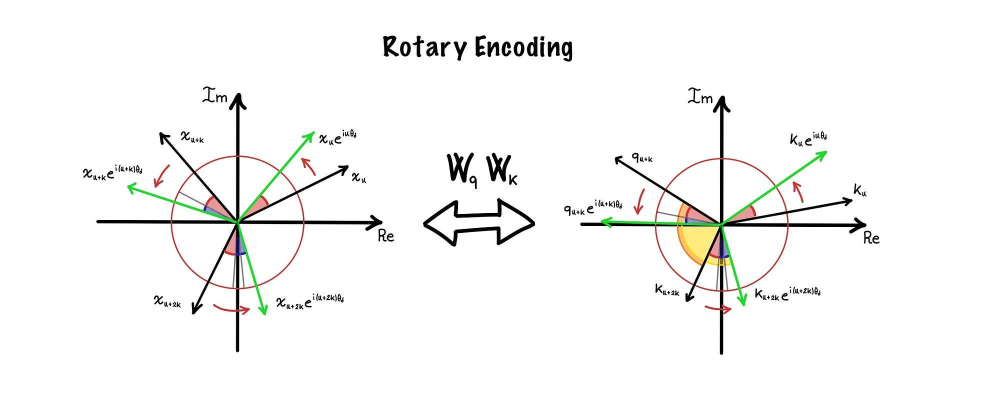

# Rotary Positional Embedding (RoPE)

This note explains **Rotary Positional Embedding (RoPE)** in Transformers: why it exists, what it does geometrically, why it gives attention relative-position awareness, and how it is implemented in practice.

The core idea is:

$$
\boxed{\text{RoPE encodes position by rotating } Q \text{ and } K \text{ as a function of token position.}}
$$

Unlike older positional encodings, RoPE does **not** add a position vector directly to the token embedding. Instead, it modifies the **query** and **key** vectors used by attention.

## 1. Why Transformers need positional information

Self-attention can compare tokens, but by itself it does not know where tokens appear in the sequence.

For example, these two token sequences contain the same words:

- `I love cats`
- `cats love I`

Their token embeddings identify the words, but attention alone does not automatically know that the ordering is different.

So we need some way to encode position.

A traditional approach is **absolute positional embedding**:

$$
\mathbf{x}_i = \mathbf{e}_i + \mathbf{p}_i
$$

where:

- $\mathbf{e}_i$ is the token embedding at position $i$;
- $\mathbf{p}_i$ is a learned or fixed positional vector.

RoPE takes a different route. It leaves the token representation alone at this stage and instead injects position directly into the attention computation.

## 2. Where RoPE sits in attention

In standard self-attention:

$$
Q = XW_Q,\qquad K = XW_K,\qquad V = XW_V
$$

and the attention output is:

$$ \mathrm{Attention}(Q,K,V) = \mathrm{softmax}\left(\frac{QK^\top}{\sqrt{d}}\right)V $$

RoPE changes this by rotating $Q$ and $K$ before the dot product:

$$
Q' = \mathrm{RoPE}(Q, m),\qquad K' = \mathrm{RoPE}(K, m)
$$

so attention becomes:

$$ \mathrm{Attention} = \mathrm{softmax}\left(\frac{Q'K'^\top}{\sqrt{d}}\right)V $$

The important detail is:

$$
\boxed{\text{RoPE is applied to } Q \text{ and } K,\ \text{not to } V}
$$

This is exactly what Figure 1 is illustrating: the query and key vectors are position-encoded by rotation before their interaction is used to compute attention.



## 3. The geometric idea: rotate pairs of coordinates

RoPE works by grouping vector coordinates into pairs and treating each pair like a 2D point.

For one pair:

$$
(x_1, x_2)
$$

This can be considered as a point at distance $r$ from the origin $(0, 0)$, at angle $\varphi$ from the $x$-axis. Its coordinates are:
 - $x_1$ = $r$ cos($\varphi$)
 - $x_2$ = $r$ sin($\varphi$)

RoPE rotates that pair by an angle $\theta$. This means the distance $r$ does not change, but the angle is now $\varphi + \theta$:
 - $x_1'$ = $r$ cos($\varphi + \theta$) = $r$ (cos $\varphi$ cos $\theta$ - sin $\varphi$ sin $\theta$ ) = $x_1$ cos $\theta$ - $x_2$ sin $\theta$
 - $x_2'$ = $r$ sin($\varphi + \theta$) = $r$ (sin $\varphi$ cos $\theta$ + cos $\varphi$ sin $\theta$ ) = $x_2$ cos $\theta$ + $x_1$ sin $\theta$ = $x_1$ sin $\theta$ + $x_2$ cos $\theta$

Read off the coefficients into a matrix, since each output is a linear combination of $x_1$ and $x_2$:

$$ \left[ \begin{array}{c} x_1' \\ x_2' \end{array} \right] = \left[ \begin{array}{cc} \cos\theta & -\sin\theta \\ \sin\theta & \cos\theta \end{array} \right] \left[ \begin{array}{c} x_1 \\ x_2 \end{array} \right] $$

So:

$$
x_1' = x_1\cos\theta - x_2\sin\theta
$$

$$
x_2' = x_1\sin\theta + x_2\cos\theta
$$

This is an ordinary 2D rotation. RoPE simply splits each query and key vector into coordinate pairs, then applies this rotation to every pair.

Figure 5 matches this mental model closely: a query or key vector is split into 2D pairs, and each pair is rotated by a position-dependent angle.



## 4. Position determines the rotation angle

Suppose a token is at position $m$. RoPE rotates its coordinates by an angle proportional to that position:

$$
\text{angle} = m\theta
$$

So:

- position $0$ rotates by $0$;
- position $1$ rotates by $\theta$;
- position $2$ rotates by $2\theta$;
- position $3$ rotates by $3\theta$.

That means the same underlying query or key direction acquires a different orientation depending on where the token appears in the sequence.

Figure 2 makes this intuitive. The first token has zero rotation, while later tokens are rotated more. The main point is not the circle radius; it is the changing **angle**.



## 5. Why this helps attention

This is the main reason RoPE is powerful.

Suppose token $i$ has query $q_i$ and token $j$ has key $k_j$. After RoPE:

For a small example, suppose the model hidden size is $d_{\text{model}} = 8$, and one attention head uses query/key dimension $d = 4$. Then each token starts with a hidden state vector in $\mathbb{R}^8$, but after projection it gets:

$$
q_t \in \mathbb{R}^4,\qquad k_t \in \mathbb{R}^4
$$

For example, token $2$ might produce:

$$
q_2 =
\begin{bmatrix}
1 \\ 2 \\ 3 \\ 4
\end{bmatrix}
$$

and token $5$ might produce:

$$
k_5 =
\begin{bmatrix}
5 \\ 6 \\ 7 \\ 8
\end{bmatrix}
$$

So in the sentence above, $q_i$ just means "the query vector of token $i$," and $k_j$ means "the key vector of token $j$." In this toy example, that could mean $i = 2$, $j = 5$, $q_i = q_2$, and $k_j = k_5$. RoPE then rotates the coordinate pairs $(1, 2)$ and $(3, 4)$ inside $q_2$, and the pairs $(5, 6)$ and $(7, 8)$ inside $k_5$, using angles based on their positions $2$ and $5$.

$$
q_i' = R(i\theta)q_i,\qquad k_j' = R(j\theta)k_j
$$

where $R(\alpha)$ is the 2D rotation matrix for angle $\alpha$.

Attention uses the dot product:

$$
{q_i'}^\top k_j'
$$

Because rotations compose cleanly, this can be rewritten so that the interaction depends on the angle difference:

$$ {q_i'}^\top k_j' = q_i^\top R((j-i)\theta)k_j $$

The crucial term is:

$$
\boxed{j - i}
$$

So the attention score naturally depends on **relative distance**, not only on absolute positions.

This is the elegant property RoPE is designed to produce: by rotating $Q$ and $K$ separately according to their own positions, their dot product automatically contains information about how far apart the two tokens are.

Figure 3 is a direct visualization of that idea. The blue and red vectors are at two different positions, and the relevant quantity comes from the angular difference, which depends on $n-m$.



## 6. A complex-number view of the same idea

Another common way to think about RoPE is to treat each coordinate pair as a complex number:

$$
x_1 + i x_2
$$

If we write this complex number in polar form as:

$$
z = r e^{i\theta}
$$

then multiplying by $e^{i\phi}$ gives:

$$
z e^{i\phi} = r e^{i\theta} e^{i\phi} = r e^{i(\theta + \phi)}
$$

This keeps the length $r$ the same and adds $\phi$ to the angle, which is exactly a 2D rotation by angle $\phi$. Using Euler's formula,

$$
e^{i\phi} = \cos\phi + i\sin\phi
$$

this is the same rotation rule we wrote earlier.

So at position $m$, a coordinate pair is transformed as:

$$
x \mapsto x e^{i m \theta}
$$

This is what Figure 4 is showing. It presents RoPE in the complex plane, where the real and imaginary axes correspond to one 2D pair of coordinates. In that view, moving to a different position means multiplying by another phase factor.

That picture also reinforces why the query-key interaction depends on relative phase difference.



## 7. Why RoPE uses multiple frequencies

If every pair of coordinates rotated with the same frequency, positional patterns would repeat too quickly. The model would have trouble distinguishing some long-range positions.

RoPE avoids that by using a different frequency for each pair of dimensions.

For model dimension $d$, define one frequency per pair:

$$
\theta_k = 10000^{-2k/d}
$$

where $k$ indexes the coordinate pair.

At position $m$, pair $k$ rotates by:

$$
m\theta_k
$$

So different pairs rotate at different speeds:

- high-frequency pairs change rapidly and capture fine local offsets;
- low-frequency pairs change slowly and preserve information over longer ranges.

Figure 5 uses the "many clocks" intuition for this. Some clocks spin quickly, some slowly. Together they create a multi-scale positional code.

That is a good mental model for RoPE:

$$
\boxed{\text{fast frequencies capture short-range position, slow frequencies capture long-range position}}
$$

## 8. The full formula

Let the head dimension be $d$, and let $k$ index the 2D coordinate pairs. For a query vector, RoPE transforms pair $(2k, 2k+1)$ at position $m$ as:

$$ \left[ \begin{array}{c} q'_{2k} \\ q'_{2k+1} \end{array} \right] = \left[ \begin{array}{cc} \cos(m\theta_k) & -\sin(m\theta_k) \\ \sin(m\theta_k) & \cos(m\theta_k) \end{array} \right] \left[ \begin{array}{c} q_{2k} \\ q_{2k+1} \end{array} \right] $$

and the same transformation is applied to the corresponding key coordinates:

$$ \left[ \begin{array}{c} k'_{2k} \\ k'_{2k+1} \end{array} \right] = \left[ \begin{array}{cc} \cos(m\theta_k) & -\sin(m\theta_k) \\ \sin(m\theta_k) & \cos(m\theta_k) \end{array} \right] \left[ \begin{array}{c} k_{2k} \\ k_{2k+1} \end{array} \right] $$

This preserves vector norm within each pair while changing its orientation as a function of position.

## 9. Comparing RoPE to other positional methods

Here is the clean conceptual distinction:

| Method | Main idea |
|---|---|
| Absolute positional embedding | Add a position vector to the token embedding |
| Sinusoidal positional embedding | Add fixed sin/cos positional vectors |
| RoPE | Rotate $Q$ and $K$ based on position |
| ALiBi | Add a position-dependent bias to attention scores |

RoPE is attractive because it does not merely stamp absolute position onto the token representation. It changes the geometry of the query-key interaction so that relative offsets naturally appear in the dot product.

## 10. How RoPE fits into a Transformer block

A simplified attention path looks like this:

```text
X
├─> W_Q ─> Q ─> RoPE ─┐
├─> W_K ─> K ─> RoPE ─┼─> Q'K'^T / sqrt(d) ─> softmax ─> attention weights
└─> W_V ─> V ─────────┘
                                      │
                                      └──────────────> weighted sum with V
```

So the operational story is:

1. project the input into $Q$, $K$, and $V$;
2. rotate $Q$ and $K$ according to token positions;
3. compute attention scores from the rotated vectors;
4. use those scores to mix the values $V$.

## 11. How to implement RoPE

In practice, RoPE is simple:

1. precompute frequencies;
2. compute position $\times$ frequency;
3. take $\cos$ and $\sin$;
4. rotate query and key pairs;
5. run normal attention.

### Precompute frequencies

For head dimension `dim`:

```python
inv_freq = 1.0 / (10000 ** (torch.arange(0, dim, 2).float() / dim))
```

If `dim = 8`, this produces one frequency for each pair:

$$
(0,1),\ (2,3),\ (4,5),\ (6,7)
$$

### Precompute position-dependent angles

For sequence length `seq_len`:

```python
positions = torch.arange(seq_len).float()
angles = positions[:, None] * inv_freq[None, :]
cos = torch.cos(angles)
sin = torch.sin(angles)
```

The shape of `angles`, `cos`, and `sin` is `[seq_len, head_dim / 2]`.

### Rotate pairs of coordinates

```python
def apply_rope_pairwise(x, cos, sin):
    x1 = x[..., 0::2]
    x2 = x[..., 1::2]

    out1 = x1 * cos - x2 * sin
    out2 = x1 * sin + x2 * cos

    return torch.stack((out1, out2), dim=-1).flatten(-2)
```

If `x` has shape `[batch, seq_len, heads, head_dim]`,

then `cos` and `sin` must be broadcastable over the sequence and head dimensions.

### A compact implementation

```python
import torch
import torch.nn as nn


class RoPE(nn.Module):
    def __init__(self, dim, max_seq_len=2048, base=10000):
        super().__init__()

        inv_freq = 1.0 / (
            base ** (torch.arange(0, dim, 2).float() / dim)
        )
        positions = torch.arange(max_seq_len).float()
        angles = positions[:, None] * inv_freq[None, :]

        self.register_buffer("cos", torch.cos(angles))
        self.register_buffer("sin", torch.sin(angles))

    def forward(self, x):
        seq_len = x.shape[1]
        cos = self.cos[:seq_len]
        sin = self.sin[:seq_len]

        x1 = x[..., 0::2]
        x2 = x[..., 1::2]

        out1 = x1 * cos - x2 * sin
        out2 = x1 * sin + x2 * cos

        return torch.stack((out1, out2), dim=-1).flatten(-2)
```

RoPE does not change the tensor shape. It only changes the orientation of coordinate pairs.

### Where it is applied

```python
Q = x @ Wq
K = x @ Wk
V = x @ Wv

Q = rope(Q)
K = rope(K)

scores = Q @ K.transpose(-2, -1)
scores = scores / math.sqrt(head_dim)
attn = torch.softmax(scores, dim=-1)
output = attn @ V
```

Again, only $Q$ and $K$ are rotated.

## 12. The most useful mental model

If you want one compact way to remember RoPE, use this:

$$ \text{position} \rightarrow \text{rotation angle} \rightarrow \text{rotate } Q \text{ and } K \rightarrow Q'K'^\top \rightarrow \text{attention that is aware of relative position} $$

Or, in one sentence:

$$
\boxed{\text{RoPE encodes position by rotating } Q \text{ and } K,\ \text{so attention naturally depends on relative distance.}}
$$

That is why RoPE became the standard positional encoding in many modern LLMs, including Llama-style architectures.

## Appendix: Complex numbers and rotation

This appendix explains the complex-number view used in Section 6.

### Cartesian form: $x_1 + i x_2$

A complex number

$$
z = x_1 + i x_2
$$

is just another way to represent a point in a 2D plane, called the **complex plane**:

- $x_1$ is the real part, plotted on the horizontal axis;
- $x_2$ is the imaginary part, plotted on the vertical axis;
- $i$ is the imaginary unit, defined by $i^2 = -1$.

So instead of writing a point as $(x_1, x_2)$, we write it as the single quantity $x_1 + i x_2$. The advantage is that complex numbers can be multiplied and divided in ways that naturally encode rotations and scalings.

### Polar form: $z = r e^{i\theta}$

The same point can also be described by its distance from the origin and its angle from the positive real axis.

If a point has radius $r$ and angle $\theta$, then:

$$
x_1 = r\cos\theta,\qquad x_2 = r\sin\theta
$$

So the same complex number can be written as:

$$
z = x_1 + i x_2 = r(\cos\theta + i\sin\theta)
$$

Euler's formula says:

$$
e^{i\theta} = \cos\theta + i\sin\theta
$$

which gives the compact polar form:

$$
z = r e^{i\theta}
$$

Here:

$$
r = |z| = \sqrt{x_1^2 + x_2^2}
$$

is the distance from the origin, and

$$
\theta = \arg(z) = \operatorname{atan2}(x_2, x_1)
$$

is the angle.

### Why multiplication by $e^{i\phi}$ is a rotation

Suppose

$$
z = r e^{i\theta}
$$

represents a point at radius $r$ and angle $\theta$. Multiply it by $e^{i\phi}$:

$$
z e^{i\phi} = r e^{i\theta} e^{i\phi} = r e^{i(\theta+\phi)}
$$

The radius stays $r$, and the angle changes from $\theta$ to $\theta + \phi$. That is exactly a rotation by angle $\phi$.

If we expand $e^{i\phi}$ using Euler's formula,

$$
e^{i\phi} = \cos\phi + i\sin\phi
$$

then

$$
(x_1 + i x_2)(\cos\phi + i\sin\phi)
$$

becomes

$$
(x_1\cos\phi - x_2\sin\phi) + i(x_1\sin\phi + x_2\cos\phi)
$$

So the rotated coordinates are:

$$
x_1' = x_1\cos\phi - x_2\sin\phi,\qquad
x_2' = x_1\sin\phi + x_2\cos\phi
$$

This is exactly the same 2D rotation rule written earlier as a matrix multiplication.

### Euler's formula from Taylor series

The exponential, cosine, and sine functions have the Taylor series:

$$
e^x = 1 + x + \frac{x^2}{2!} + \frac{x^3}{3!} + \frac{x^4}{4!} + \cdots
$$

$$
\cos x = 1 - \frac{x^2}{2!} + \frac{x^4}{4!} - \frac{x^6}{6!} + \cdots
$$

$$
\sin x = x - \frac{x^3}{3!} + \frac{x^5}{5!} - \frac{x^7}{7!} + \cdots
$$

Now substitute $x = i\theta$ into the exponential series:

$$
e^{i\theta}
= 1 + i\theta + \frac{(i\theta)^2}{2!} + \frac{(i\theta)^3}{3!} + \frac{(i\theta)^4}{4!} + \cdots
$$

Because powers of $i$ cycle as

$$
i,\ -1,\ -i,\ 1,\ i,\ -1,\ \ldots
$$

this becomes

$$
e^{i\theta}
= \left(1 - \frac{\theta^2}{2!} + \frac{\theta^4}{4!} - \cdots\right)
+ i\left(\theta - \frac{\theta^3}{3!} + \frac{\theta^5}{5!} - \cdots\right)
$$

The first bracket is exactly $\cos\theta$, and the second is exactly $\sin\theta$. Therefore:

$$
e^{i\theta} = \cos\theta + i\sin\theta
$$

### Why angles add under complex multiplication

Take two complex numbers in polar form:

$$
z_1 = r_1 e^{i\theta_1},\qquad z_2 = r_2 e^{i\theta_2}
$$

Using Euler's formula:

$$
z_1 z_2
= r_1 r_2 (\cos\theta_1 + i\sin\theta_1)(\cos\theta_2 + i\sin\theta_2)
$$

Expanding gives:

$$
z_1 z_2
= r_1 r_2 \left[
(\cos\theta_1\cos\theta_2 - \sin\theta_1\sin\theta_2)
+ i(\sin\theta_1\cos\theta_2 + \cos\theta_1\sin\theta_2)
\right]
$$

Now use the angle-sum identities:

$$
\cos(\theta_1 + \theta_2) = \cos\theta_1\cos\theta_2 - \sin\theta_1\sin\theta_2
$$

$$
\sin(\theta_1 + \theta_2) = \sin\theta_1\cos\theta_2 + \cos\theta_1\sin\theta_2
$$

So:

$$
z_1 z_2 = r_1 r_2 \left(\cos(\theta_1+\theta_2) + i\sin(\theta_1+\theta_2)\right)
= r_1 r_2 e^{i(\theta_1+\theta_2)}
$$

So under complex multiplication:

- magnitudes multiply;
- angles add.

That is the key reason RoPE can be written as a complex phase multiplication. Multiplying by $e^{i\phi}$ adds an angle $\phi$, which is exactly what a rotation does.
